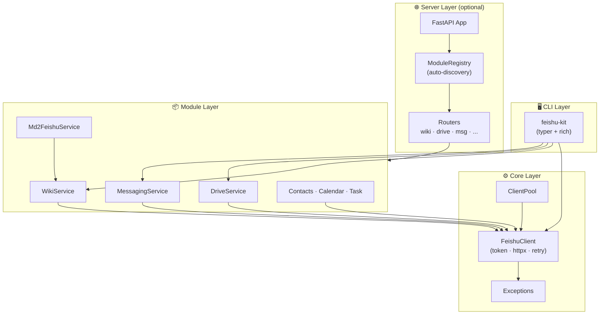

<p align="center">
  <pre>
 ███████╗███████╗██╗     ██╗         ██████╗ ██╗  ██╗██╗████████╗
 ██╔════╝██╔════╝██║     ██║         ██╔══██╗██║ ██╔╝██║╚══██╔══╝
 █████╗  █████╗  ██║     ██║         ██████╔╝█████╔╝ ██║   ██║
 ██╔══╝  ██╔══╝  ██║     ██║         ██╔═══╝ ██╔═██╗ ██║   ██║
 ██║     ███████╗███████╗███████╗    ██║     ██║  ██╗██║   ██║
 ╚═╝     ╚══════╝╚══════╝╚══════╝    ╚═╝     ╚═╝  ╚═╝╚═╝   ╚═╝
  </pre>
</p>

<p align="center">
  <strong>A modular, async-first Python toolkit for Feishu (Lark) Open Platform</strong><br>
  7 API modules · CLI · FastAPI server · Markdown converter · Course-friendly
</p>

<p align="center">
  <a href="https://github.com/HustWolfzzb/feishu-kit/actions/workflows/ci.yml">
    
  </a>
  <a href="https://pypi.org/project/feishu-kit/">
    
  </a>
  <a href="https://pypi.org/project/feishu-kit/">
    
  </a>
  <a href="https://github.com/HustWolfzzb/feishu-kit/blob/main/LICENSE">
    
  </a>
  <a href="https://hustwolfzzb.github.io/feishu-kit/">
    
  </a>
  <a href="https://github.com/HustWolfzzb/feishu-kit">
    
  </a>
</p>

---

## :sparkles: Feature Grid

| | Module | What it does |
|:---:|:-------|:-------------|
| :books: | **Wiki** | Spaces, nodes, docs, permissions, RAG retrieval |
| :floppy_disk: | **Drive** | Upload, download, folders, permissions |
| :speech_balloon: | **Messaging** | Send, reply, chats, reactions, pins |
| :busts_in_silhouette: | **Contacts** | Users, departments, groups |
| :calendar: | **Calendar** | Events, calendars, free/busy query |
| :white_check_mark: | **Task** | Tasks, task lists, members, comments |
| :memo: | **md2feishu** | Markdown → Feishu DocX with one call |

Plus a :rocket: **CLI** (`feishu-kit` command) and an optional :globe_with_meridians: **FastAPI server** layer.

---

## :zap: Quick Start

### Install

```bash
pip install feishu-kit
```

### CLI (zero code)

```bash
export FEISHU_APP_ID="cli_xxx"
export FEISHU_APP_SECRET="xxx"

feishu-kit spaces
```

Output:

```
        Name         │         Space ID        │ Description
 ────────────────────┼─────────────────────────┼─────────────
  Embodied AI Course  │  7264xxxxxx              │  Course wiki
  Project Docs        │  7389xxxxxx              │  Team docs
```

### Python (5 lines)

```python
import asyncio
from feishu_kit import FeishuClient

async def main():
    async with FeishuClient(app_id="cli_xxx", app_secret="xxx") as client:
        result = await client.request("GET", "/wiki/v2/spaces")
        for space in result.get("data", {}).get("items", []):
            print(f"📚 {space['name']}")

asyncio.run(main())
```

### Use a module

```python
from feishu_kit import FeishuClient
from feishu_kit.modules.wiki import WikiService

async with FeishuClient(app_id="cli_xxx", app_secret="xxx") as client:
    wiki = WikiService(client)
    nodes = await wiki.list_all_nodes("your_space_id")
    for node in nodes:
        print(node["title"])
```

### Push Markdown to Wiki

```python
from feishu_kit.modules.md2feishu import Md2FeishuService

md = Md2FeishuService(wiki)
result = await md.push_markdown("# Hello\n\nWorld!", title="My Doc", space_id="...")
print(result["url"])
```

### Multi-bot

```python
from feishu_kit import ClientPool

pool = ClientPool()
pool.add("default", "cli_app1_id", "cli_app1_secret")
pool.add("bot2", "cli_app2_id", "cli_app2_secret")
```

---

## :building_construction: Architecture



---

## :grey_question: Why feishu-kit?

| | Reason |
|:---:|:-------|
| :electric_plug: | **Async-first** — every API call is `async`, powered by httpx connection pooling |
| :scissors: | **Zero framework lock-in** — core has no FastAPI dependency; use in scripts, Jupyter, any web framework |
| :card_file_box: | **Modular** — each module is independent; import only what you need |
| :shield: | **Resilient** — automatic retries with exponential backoff on 429/5xx |
| :teacher: | **Course-friendly** — progressive examples from "Hello Feishu" to a full AI Agent course builder |

---

## :gear: CLI Reference

| Command | Description |
|---------|-------------|
| `feishu-kit spaces` | List knowledge spaces |
| `feishu-kit nodes <space_id>` | List nodes in a space (tree view) |
| `feishu-kit push <file.md> <space_id>` | Push Markdown file to Wiki |
| `feishu-kit inspect <token>` | Inspect document content |
| `feishu-kit chats` | List bot chats |
| `feishu-kit version` | Print version with banner |

All commands read `FEISHU_APP_ID` and `FEISHU_APP_SECRET` from environment variables.

---

## :books: Documentation

| Document | Description |
|----------|-------------|
| [Getting Started](docs/getting-started.md) | Environment setup, first script |
| [Wiki Tutorial](docs/tutorial-wiki.md) | Knowledge base CRUD operations |
| [Drive Tutorial](docs/tutorial-drive.md) | File upload, download, permissions |
| [Messaging Tutorial](docs/tutorial-messaging.md) | Messages, chats, cards |
| [Markdown to Feishu](docs/tutorial-md2feishu.md) | Convert and push documents |
| [Server Tutorial](docs/tutorial-server.md) | Build a FastAPI REST API |
| [Course Builder Guide](docs/project-build-course.md) | End-to-end course creation with AI Agent |

---

## :test_tube: Examples

| # | Example | What you learn |
|---|---------|----------------|
| 01 | [Hello Feishu](examples/01-hello-feishu.py) | Minimal script, list knowledge spaces |
| 02 | [Wiki Basics](examples/02-wiki-basics.py) | CRUD operations on wiki nodes |
| 03 | [Write Document](examples/03-write-document.py) | Create docs, write content blocks |
| 04 | [Upload File](examples/04-upload-file.py) | Upload to Drive, move into Wiki |
| 05 | [MD to Wiki](examples/05-md-to-wiki.py) | Convert Markdown to Feishu docs |
| 06 | [Multi-Bot](examples/06-multi-bot.py) | Manage multiple bots with ClientPool |
| 07 | [Course Builder](examples/07-course-builder/course_builder.py) | Full course creation + PPT generation |

---

## :handshake: Contributing

See [CONTRIBUTING.md](CONTRIBUTING.md) for development setup, code style, and PR process.

## :scroll: Changelog

See [CHANGELOG.md](CHANGELOG.md) for release history.

## :page_facing_up: License

[MIT](LICENSE) — free for personal and commercial use.
