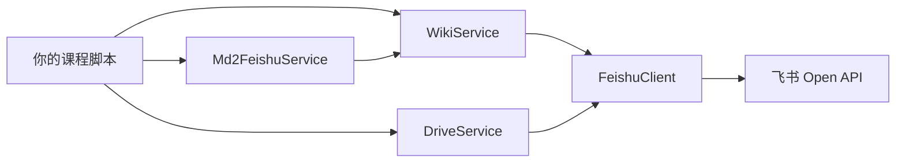

# Ch7: 完整工作流与 FAQ

## 全流程回顾

```
1. 环境准备                    ← Ch1
   ├─ 注册飞书应用，获取凭证
   ├─ pip install feishu-kit
   └─ feishu-kit spaces 验证连接

2. 创建骨架                    ← Ch2, WikiService
   ├─ 手动创建知识空间
   ├─ wiki.create_node() 创建章节
   └─ wiki.create_node(parent) 创建小节

3. AI 填充内容                 ← Ch3, WikiService + Claude
   ├─ 构建内容块 (heading/text/bullet)
   ├─ wiki.create_doc_block() 写入
   ├─ 或 Md2FeishuService.push_markdown() 推送
   └─ 或 CLI: feishu-kit push file.md space_id

4. 内容审查                    ← Ch4
   ├─ feishu-kit inspect token 查看内容
   ├─ Claude 审查去 AI 味
   └─ 追加修正块

5. PPT 课件                    ← Ch5, DriveService + WikiService
   ├─ python-pptx 生成
   ├─ drive.upload_file() 上传
   └─ wiki.move_docs_to_wiki(obj_type="file") 移入

6. 内容扩充                    ← Ch6
   ├─ 学术引用补充
   ├─ 产业数据添加
   └─ Md2FeishuService 快速推送

7. 持续维护
   ├─ wiki.search_nodes() 搜索
   ├─ wiki.get_doc_raw_content() 读取
   └─ wiki.create_doc_block(index=-1) 增量更新
```

## feishu-kit 在工作流中的角色

| 步骤 | feishu-kit 模块 | 核心方法 |
|------|----------------|---------|
| 连接验证 | `FeishuClient` / CLI | `feishu-kit spaces` |
| 创建骨架 | `WikiService` | `create_node()`, `list_all_nodes()` |
| 填充内容 | `WikiService` | `create_doc_block()` |
| Markdown 推送 | `Md2FeishuService` | `push_markdown()`, `preview()` |
| 内容查看 | `WikiService` / CLI | `feishu-kit inspect` |
| PPT 上传 | `DriveService` | `upload_file()` |
| PPT 挂载 | `WikiService` | `move_docs_to_wiki()` |
| 搜索节点 | `WikiService` | `search_nodes()` |

### 架构一览



所有 Service 都通过 `FeishuClient` 与飞书 API 通信，`Md2FeishuService` 内部依赖 `WikiService`。

## FAQ

### API 返回 "forbidden" (code: 99991668)

检查飞书应用的权限范围是否已开通并发布。部分 API 需要管理员审批。

### 上传 PPT 后在知识库看不到文件节点

确保使用 `wiki.move_docs_to_wiki()` 而非 `wiki.create_node()`。`create_node` 只支持 `docx` 类型，PPT 必须先上传到云盘再用 `move_docs_to_wiki` 移入，且 `obj_type="file"`。

### 文档块写入返回 "invalid param"

检查是否有空的 text_run（`elements: []`），飞书 API 不接受空元素列表。用空格代替：`t(" ")`。

### 触发限流 (code: 99991400)

feishu-client 内置了自动重试（最多 3 次，指数退避）。如果你看到 `RateLimitError`，说明所有重试都已耗尽，需要等待更长时间。也可以在飞书开放平台申请提升 QPS。

### 如何处理批量操作中的错误

每个小节单独 try/except，记录失败的 obj_token，最后统一重试：

```python
from feishu_kit.core.exceptions import APIError

failed = []
for obj_token, blocks in all_content.items():
    try:
        await wiki.create_doc_block(obj_token, obj_token, blocks)
    except APIError as e:
        failed.append((obj_token, f"code={e.code}: {e.msg}"))

for obj_token, error in failed:
    print(f"RETRY: {obj_token} — {error}")
```

### 如何搜索已有节点

```python
results = await wiki.search_nodes(space_id, keyword="具身智能")
for item in results.get("data", {}).get("items", []):
    print(item["title"], item["node_token"])
```

### 能否删除节点

飞书 API 目前不支持删除知识库节点。需要在飞书客户端中手动删除。

## 进阶方向

- **多 Bot 协作**：用 `ClientPool` 管理多个飞书应用，分别负责不同课程
- **FastAPI 服务**：用 feishu-kit 的 `server` 层搭建课程管理 API
- **全自动生成**：集成 LLM API（如 Claude/GPT），实现从大纲到完整内容的自动生成
- **飞书多维表格**：用飞书的多维表格做课程进度管理和质量追踪
- **Web Dashboard**：参考 `examples/08-web-dashboard`，搭建课程管理面板

---

上一章：[Ch6: 内容扩充](ch06-enrich.md) | [返回目录](index.md)
